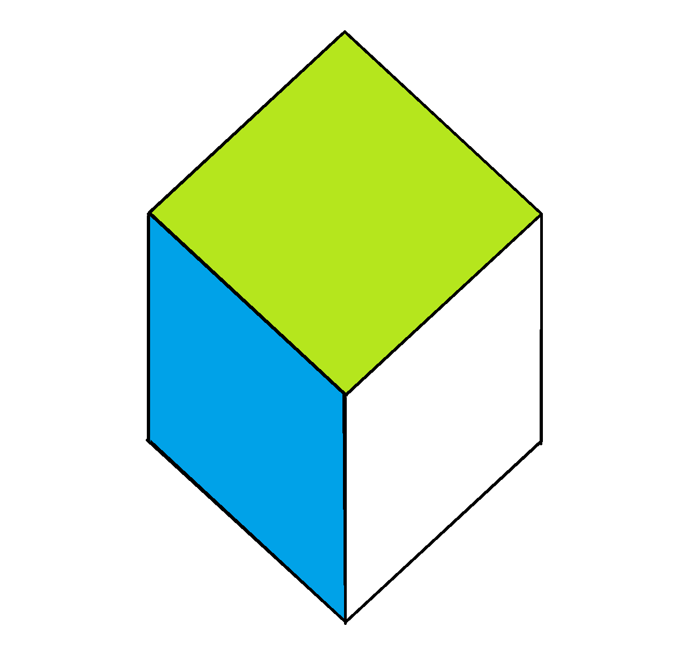

<h1 align="center">CUBE CLICKER</h1>
 

  

Cube Clicker es un videojuego de Android con un cubo cuyas caras estás coloreadas,y clicando en ellas, impulsamos hacia arriba el cubo. Debemos evitar que el cubo caiga, con la dificultad añadida de que cada click, cambia el color de fondo con el mismo color de la cara clicada, y si clicamos en una cara del mismo color que el fondo el juego termina.

## 🖼️ Capturas
Visita mi portfolio en el [enlace](https://fornie-dev-portfolio.vercel.app/projectDetail2/Cube%20Clicker)

## 👨‍💻 Autores
- [@fornieDev](https://github.com/fornieDev)
